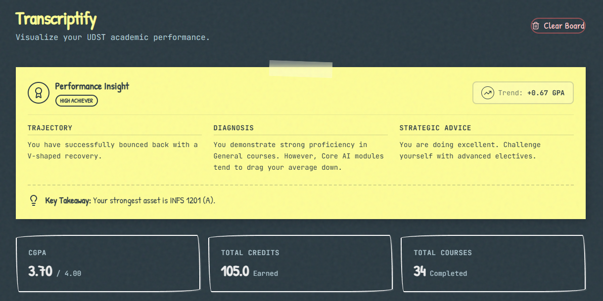

# Transcriptify 🎓📊

**Transcriptify** is a privacy-first, interactive transcript visualizer designed for UDST students. It transforms your unofficial PDF transcript into a beautiful, "Digital Chalkboard" dashboard, helping you analyze your academic performance, track trends, and simulate future GPA scenarios.



## ✨ Key Features

*   **🔒 Privacy First**: Your transcript is processed 100% in your browser. No data is ever sent to a server.
*   **🎨 Digital Chalkboard Aesthetic**: A unique, hand-crafted UI featuring "Patrick Hand" and "JetBrains Mono" typography, chalk textures, and smooth "dust-off" transitions.
*   **📈 Interactive Analytics**:
    *   **GPA Trend Graph**: Watch your CGPA and Term GPA get "drawn" on the board.
    *   **Subject Radar**: Visualize your strengths across different subject areas (Core AI, Math, Computer Science, etc.).
    *   **Grade Distribution**: Analyze your grade spread by count or credits, with detailed course lists on hover.
*   **🔮 GPA Simulator**: A "What-If" tool to calculate how future grades will impact your cumulative GPA.
*   **🔍 Global Filtering**: Filter the entire dashboard by Year and Term to focus on specific academic periods.
*   **📝 Smart Course List**: Searchable history with a built-in "Resume Bullet" generator for your CV.

## 🛠️ Tech Stack

*   **Framework**: [Next.js 15](https://nextjs.org/) (App Router)
*   **Styling**: [Tailwind CSS](https://tailwindcss.com/) with custom configuration
*   **Animations**: [Framer Motion](https://www.framer.com/motion/) & [GSAP](https://greensock.com/gsap/)
*   **Charts**: [Recharts](https://recharts.org/)
*   **PDF Parsing**: [pdfjs-dist](https://mozilla.github.io/pdf.js/)
*   **Icons**: [Lucide React](https://lucide.dev/)
*   **Fonts**: [Patrick Hand](https://fonts.google.com/specimen/Patrick+Hand) & [JetBrains Mono](https://fonts.google.com/specimen/JetBrains+Mono)

## 🚀 Getting Started

First, install the dependencies:

```bash
npm install
# or
yarn install
```

Then, run the development server:

```bash
npm run dev
# or
yarn dev
```

Open [http://localhost:3000](http://localhost:3000) with your browser to see the result.

## 📂 Project Structure

*   `app/`: Next.js App Router pages and layouts.
    *   `page.tsx`: Main dashboard logic and state management.
    *   `globals.css`: Global styles, including the chalkboard texture and custom variables.
*   `components/`: Reusable UI components.
    *   `dashboard/`: Dashboard-specific widgets (TrendGraph, SubjectRadar, etc.).
    *   `ui/`: Generic UI elements (Card, Button, Input) with chalkboard styling.
*   `utils/`: Helper functions.
    *   `transcript-parser.ts`: Logic for parsing PDF text into structured Course objects and calculating stats.

## 📝 Usage

1.  **Export your Transcript**: Log in to your student portal and download your "Unofficial Transcript" as a PDF.
2.  **Upload**: Drag and drop the PDF into the landing zone on Transcriptify.
3.  **Analyze**: Explore your data! Use the filters at the top of the course list to slice and dice your academic history.
4.  **Simulate**: Use the "GPA Simulator" card to see what grades you need to hit your target GPA.

## 🤝 Contributing

Contributions are welcome! Please feel free to submit a Pull Request.

## 📄 License

This project is open-source and available under the [MIT License](LICENSE).
